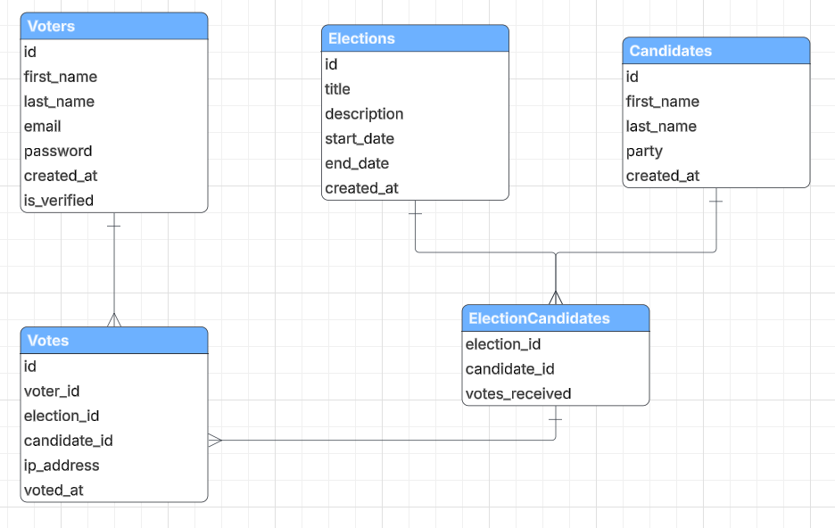

# Voting System

### MILESTONE 1:
- Complete Single Page Application for SecureVote with 4 main pages
- Project structure with organized folders for frontend and backend
- Static frontend with Bootstrap styling and responsive design
- SPA navigation that works without page reloads
- Login/Register modals for user authentication
- Voting interface with candidate selection
- Results page with chart visualization
- ERD diagram with 5 database entities for the voting system

### MILESTONE 2:
- MySQL database with 5 entities (Voters, Elections, Candidates, ElectionCandidates, Votes)
- Complete DAO layer with CRUD operations for all entities
- Database configuration using PDO with secure prepared statements
- Base DAO class with common database operations
- Entity-specific DAOs with custom voting business logic
- SQL schema file for database creation and setup
- Test file to verify all DAO functionality works correctly

### MILESTONE 3:
- Complete service layer with BaseService and entity-specific services
- Business logic with validation rules, password hashing, and vote integrity checks
- FlightPHP REST API with CRUD operations and JSON responses
- Organized route files for Voters, Elections, Candidates, and Votes
- OpenAPI documentation with Swagger UI for interactive testing